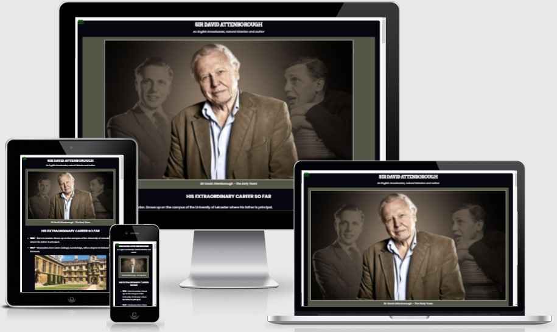

# Tribute Page

This is a freeCodeCamp Responsive WEb Design Project.

The overall aim was to acheive a tribute page for a famous figure, my inspiration for this project was Sir David Attenborough, using SASS, and HTML to help me develop my front end skills further!

## Showcase

 

A deployed version of my website can be found [here](https://elliej87.github.io/TributePage/)

This domain will allow you to access the Tribute Page website.

## Table of Contents

1. [User Experience UX](#userexperienceuX)

    * [User Stories](#userstories)

        - [User Story #1](#userstory_1)
        - [User Story #2](#userstory_2)
        - [User Story #3](#userstory_3)
        - [User Story #4](#userstory_4)
        - [User Story #5](#userstory_5)
        - [User Story #6](#userstory_6)
        - [User Story #7](#userstory_7)
        - [User Story #8](#userstory_8)
        - [User Story #9](#userstory_9)
        - [Site Owner Goals](#sitegoals)

2. [Wireframes](#wireframesboards)

3. [Features](#featuressite)

    * [Main Container](#maincontainer)
    * [Footer](#footerfeatures)

4. [Technologies Used](#technologies)

    * [Version Control](#versioncontrol)

5. [Functionality Testing](#functionalitytesting)
  
    - [Footer Social Navigation Links](#footerlinks)
      * [LinkedIn Icon](#linkedinicon)
      * [GitHub Icon](#githubicon)

6. [Responsive Design Testing](#responsivedesigntesting)

7. [Validation](#validationcode)
    - [HTML](#htmlcode)
    - [CSS](#csscode) 

8. [Deployment](#deploymentsite)

    * [Repository Link](#repositorylink)
    * [Running Code Locally](#runningcodelocally)

9. [Credits](#finalcredits)

    * [Content](#contentsite)
    * [Acknowledgments](#acknowledgmentsthanks)

## <a name="userexperienceuX">UX (User Experience)</a>

This website is for anyone who wants to get a full time tline of Sir David Attenborough's life and acheivements.

This site also has a link to his wikepedia site towards the bottom of the page along with links to my social media sites where they can interact with me directly.

## <a name="userstories">User Stories</a>

### <a name="userstory_1">User Story #1</a>

- My tribute page should have an element with a corresponding id="main", which contains all other elements.

### <a name="userstory_2">User Story #2</a>

- I should see an element with a corresponding id="title", which contains a string (i.e. text) that describes the subject of the tribute page (e.g. "Dr. Norman Borlaug").

### <a name="userstory_3">User Story #3</a>

- I should see either a figure or a div element with a corresponding id="img-div".

### <a name="userstory_4">User Story #4</a>

- Within the img-div element, I should see an img element with a corresponding id="image".

### <a name="userstory_5">User Story #5</a>

- Within the img-div element, I should see an element with a corresponding id="img-caption" that contains textual content describing the image shown in img-div.

### <a name="userstory_6">User Story #6</a>

- I should see an element with a corresponding id="tribute-info", which contains textual content describing the subject of the tribute page.

### <a name="userstory_7">User Story #7</a>

- I should see an a element with a corresponding id="tribute-link", which links to an outside site that contains additional information about the subject of the tribute page. HINT: You must give your element an attribute of target and set it to _blank in order for your link to open in a new tab (i.e. target="_blank").

### <a name="userstory_8">User Story #8</a>

- The img element should responsively resize, relative to the width of its parent element, without exceeding its original size.

### <a name="userstory_9">User Story #9</a>

- The img element should be centered within its parent element.

### <a name="sitegoals">Site Owner Goals</a>

- As a site owner I want to ensure the user gets insightful and new information that they might not have known about Sir David Attenborough.

## <a name="wireframesboards">Wireframes</a>

As this was a brief project no wireframes were designed prior to building this site.

## <a name="featuressite">Features</a>

This section is a brief highlight of features that this site contains.

### <a name="maincontainer">Main Container</a>

- The main body is vertically centered in the view port width
- Jumbotron image is contained within a contrast colour to break the page up and to clear differentiation to state this is the header
- Has a contrast white body background with a black container with rounded corners for a softer look
- All main body text is in white for clear readability
- Images are centered within the body and all hold the same width for design appeal
- Wikipedia page link is in a different colour to indicate this is a link, on hover this has a subtle colour ease change

### <a name="footerfeatures">Footer</a>

- Contains the copyright text, this is on the right side of the page which is then centred and on the bottom of the social media links on smaller screens for easy readability.
- Contains the ‘LinkedIn’ and ‘GitHub’ navigation links on the left side of the page and evenly spaced these are then stacked ontop of the copyright text, these are centred to the width of the screen
- All navigation links have an animation and a colour change when the user hover over the icon, this is so the user knows they are interactive and have a purpose
- The ‘LinkedIn’ and ‘GitHub’ icons opens a new window to the relevant page 
- The footer runs along and is fixed at the bottom with no fill colour to make this easy to read and visual appealing

## <a name="technologies">Technologies Used</a>

[Bootstrap](https://getbootstrap.com)

- The project uses the Bootstrap framework to add a responsive grid system, prebuilt components, plugins built on jQuery, and Bootstrap styles to my site, before adding my own custom styling 

[CSS](https://en.wikipedia.org/wiki/CSS)

- The project uses CSS to apply the custom styles to create the look of my site.  The index.html file is linked directly to the main.css stylesheet

[Font Awesome](https://fontawesome.com/v4.7/) 

- The project uses Font Awesome icons for all navigation and social media links that feature in the header and footer of my site

Google Chrome Dev Tools

- For testing purposes for responsive design

[HTML5](https://en.wikipedia.org/wiki/HTML5)

- The project uses HTML to create the basic elements and content of my site 

[JavaScript](https://en.wikipedia.org/wiki/JavaScript)

- The project also uses JavaScript from Bootstrap which is required to add functionality to the Bootstrap modal 

[jQuery](https://en.wikipedia.org/wiki/JQuery)

- The project uses jQuery to simplify DOM manipulation. This is both the standard jQuery that is built with Bootstrap components

[SASS](https://en.wikipedia.org/wiki/Sass_(stylesheet_language))

- The project uses SASS to apply the custom styles to create the look of my site.  The index.html file is linked directly to the main.css stylesheet

[Visual Studio Code](https://code.visualstudio.com)

- I used Visual Studio Code as the development environment to write the code for my website

### <a name="versioncontrol">Version Control</a>

[Git](https://git-scm.com)

-	I've used Git as a version control system to regularly add and commit changes made to project in Visual Studio Code, before pushing them to GitHub.

[GitHub](https://github.com)

-	I've used GitHub as a remote repository to push and store the committed changes to my project from Git. I've also used GitHub pages to deploy my website in a live environment.

## <a name="testingcases">Testing</a>

# <a name="functionalitytesting">Functionality Testing</a>

Browsers tested: Google Chrome, Mozilla Firefox & Opera.
The devices used in this testing include Samsung S10 v.Android 10.

## <a name="footerlinks">Footer Social Navigation Links</a>

### <a name="linkedinicon">LinkedIn Icon</a>

Expected: when hovering over 'LinkedIn' icon, the icon changes colour
Testing: tested by hovering over item
Result: icon changes colour

Expected: when clicking on the ‘LinkedIn’ icon takes the user to my LinkedIn page
Testing: tested by clicking on the ‘LinkedIn’ icon
Results: link takes user to [LinkedIn](https://www.linkedin.com/in/ellie-judge-45b00689/)
 
### <a name="githubicon">GitHub Icon</a>

Expected: when hovering over 'GitHub' icon, the icon changes colour
Testing: tested by hovering over item
Result: icon changes colour

Expected: when clicking on the ‘GitHub’ icon takes the user to my GitHub repo page
Testing: tested by clicking on the ‘GitHub’ icon
Results: link takes user to [GitHub](https://github.com/EllieJ87)

## <a name="validationcode">Validation</a>

### <a name="htmlcode">HTML</a>

W3C testing completed for: index.html
No issues were stated.
 
## <a name="csscode">CSS</a>

W3C testing completed for: styles.css
No issues were stated.

## <a name="deploymentsite">Deployment</a>

The hosting platform that I've used for my project is GitHub Pages. To deploy my website to GitHub pages, I used the following steps:

-	Loaded the terminal window in my visual studio code workspace
-	Initialised Git using the Source Control in the control panel
-	Files that have been amended are automatically listed in the ‘Source Control’ panel
-	Add message in the ‘Message’ section, making sure the commits are clear and concise (re-checked previous commits for layout and what was fixed / still pending)
-	Click the ‘tick’ icon which stored the files in visual studio code
-	Click the ‘ellipsis’ icon and select the ‘push’ option
-	This then push all files and commits to the main branch
-	This will add the updated files into the ‘main branch’ option under the ‘GitHub pages’ section
-	Ran several commits after testing was carried out throughout my project.

### <a name="repositorylink">Repository Link</a>

[Mindful Meditation](https://elliej87.github.io/TributePage/)

### <a name="runningcodelocally">Running Code Locally</a>

To run my code locally, users can download a local copy of my code to their desktop by completing the following steps:

-	Go to my GitHub repository.
-	Click on 'Clone or download'.
-	Click on 'Download ZIP'.
-	Once downloaded, extract the zip file's contents and run my website locally.

## <a name="contentsite">Content</a>

This website was a quick and fun site for me to practice more web development skills and styling .

## <a name="acknowledgmentsthanks">Acknowledgments</a>

_**Created by Ellie Judge**_
